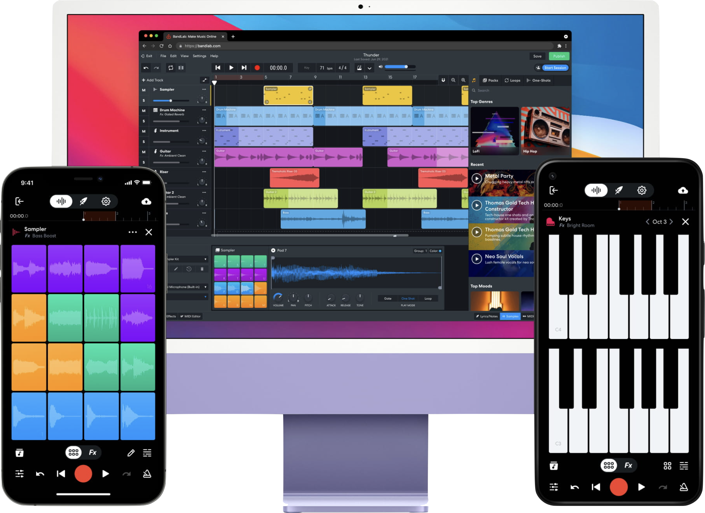
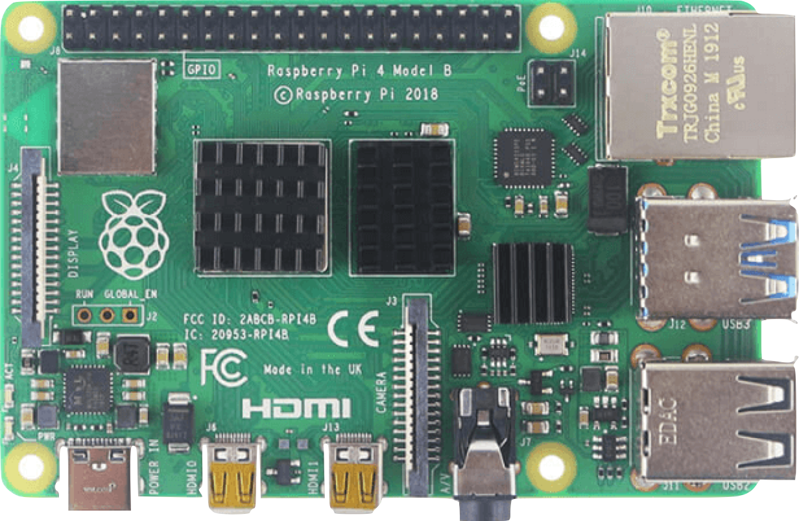

<link rel="preconnect" href="https://fonts.googleapis.com">
<link rel="preconnect" href="https://fonts.gstatic.com" crossorigin>
<link href="https://fonts.googleapis.com/css2?family=Nunito:wght@200;500;700&family=Roboto:ital,wght@0,100;0,300;0,400;0,500;0,700;1,100&display=swap" rel="stylesheet">

<link rel="stylesheet" href="./css/slidetemplate.css"> 
<!-- align:centre -->

# <!-- fit --> 

---

# "How to make Sound??"

---
<!-- _theme: gaia -->
## Creation tools for sound/music
- A Brief introduction to Digital Audio Tools
<!-- - How we can make use of it -->
- Tools for making Digital Musical Instruments

- Strategies for Prototyping
  - DEMOs

---
<!-- center -->
## The Three Elements of Sound

 

---
## The Three Elements of Sound

Pitch / Dynamics / Tone Color

 

<!--   -->

---
## The Three Elements of Sound

Frequency / Amplitude / Waveform

 

---
### Sound Editor App
Adobe Audition
https://www.adobe.com/sg/products/audition.html

Audacity(Free)
https://www.audacityteam.org/

<!--  -->

<!--  -->

--- 

### Demo: Sound Editor
Waveform - Spectrum - Pitch
Generate Tone and Apply Effects

---
# <!--fit-->Sound/Music Archives
BBC Sound Effects
https://sound-effects.bbcrewind.co.uk/
Free Music Archive
https://freemusicarchive.org/
Free Sound
https://freesound.org/

---
<!--SoundFile 01 p5.js -->

<iframe src="https://editor.p5js.org/didny/full/BOHN1rJCl"></iframe>

---

###  Otama Tone

**Neck** → Pitch Control

**Mouth** → Tone Color 

---

<!--  -->
### Analogue Synthesizer

---

<!--  -->
### Analogue Synthesizer

---

## The Three Elements of Music

 Melody / Rhythm / Harmony

 

---
Instacode

<iframe width="1200" height="720" src="https://www.youtube.com/embed/nJGae9zGokQ" title="YouTube video player" frameborder="0" allow="accelerometer; autoplay; clipboard-write; encrypted-media; gyroscope; picture-in-picture" allowfullscreen></iframe>

---

  <iframe src='https://player.vimeo.com/video/14563912?h=4942facdc3' frameborder='0' webkitAllowFullScreen mozallowfullscreen allowFullScreen></iframe>

---
<iframe width="1200" height="720" src="https://www.youtube.com/embed/6qnu3dKc4Q0" title="YouTube video player" frameborder="0" allow="accelerometer; autoplay; clipboard-write; encrypted-media; gyroscope; picture-in-picture" allowfullscreen></iframe>

---
#  Music Making App

BandLab (online/free)
https://www.bandlab.com/mix-editor

GarageBand (mac/iOS/free)
https://www.apple.com/sg/mac/garageband/

SoundBridge (win/free)
https://soundbridge.io/

---

## Demo:  Virtual Instruments 

---
# <!-- fit -->Making Sound with Programmable Hardware

---
## Prototyping Strategies

- Control Existing Synthesizer **(MIDI Controller)**
- Trigger Sampled Sound **(Wav Player)**
- Generate Sound with Algorithm **(Digital Synth)**
- Actuate Physical Instrument **(Phygital Synth)**  

---
<!-- wireless midi -->
<iframe width="1200" height="720" src="https://www.youtube.com/embed/ae8z2ymEMGQ" title="YouTube video player" frameborder="0" allow="accelerometer; autoplay; clipboard-write; encrypted-media; gyroscope; picture-in-picture" allowfullscreen></iframe>

---
<!-- wav trigger -->
<iframe width="1200" height="720" src="https://www.youtube.com/embed/Hgzi3ArChQ0" title="YouTube video player" frameborder="0" allow="accelerometer; autoplay; clipboard-write; encrypted-media; gyroscope; picture-in-picture" allowfullscreen></iframe>

---
<!-- AT Tiny synth-->

<iframe width="1200" height="720" src="https://www.youtube.com/embed/BP1CbmxvEw0" title="YouTube video player" frameborder="0" allow="accelerometer; autoplay; clipboard-write; encrypted-media; gyroscope; picture-in-picture" allowfullscreen></iframe>

---
<!--solenoid synth -->
<iframe width="1200" height="720" src="https://www.youtube.com/embed/dhKYxDzyXqI" title="YouTube video player" frameborder="0" allow="accelerometer; autoplay; clipboard-write; encrypted-media; gyroscope; picture-in-picture" allowfullscreen></iframe>

--- 

## Arduino 
Tone Library
https://github.com/daniel-centore/arduino-tone-library
USB-MIDI Library
https://github.com/BlokasLabs/usbmidi
Arduino Wav Trigger (polyphonic sound player for Arduino)
https://www.sparkfun.com/products/13660
Digital Audio Library
https://sensorium.github.io/Mozzi/

--- 

## micro:bit 
MIDI Controller
https://makecode.microbit.org/pkg/microsoft/pxt-midi
Audio player (sampler)
https://microbit-micropython.readthedocs.io/en/v2-docs/audio.html
Tone Generator
https://makecode.microbit.org/reference/music/play-tone

---
# Programming Sound 

---

# p5.sound

JavaScript library to create WebAudio
https://p5js.org/reference/#/libraries/p5.sound

---

<iframe src="https://editor.p5js.org/didny/sketches/hpT04HDSM"></iframe>

---
# More sound programming language

Ableton Live (mac/win/trial)
https://www.ableton.com/en/

Max/MSP
https://cycling74.com/products/max

pyo: python library for audio signal processing
http://ajaxsoundstudio.com/software/pyo/

touchDesigner: 
https://derivative.ca/

---
<!-- class:  -->
# <!-- fit --> Week 6:
# <!-- fit --> USB-MIDI Instrument Workshop

