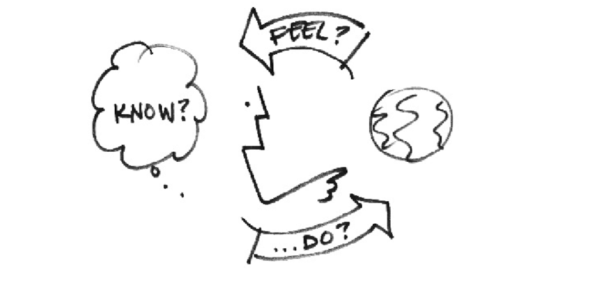
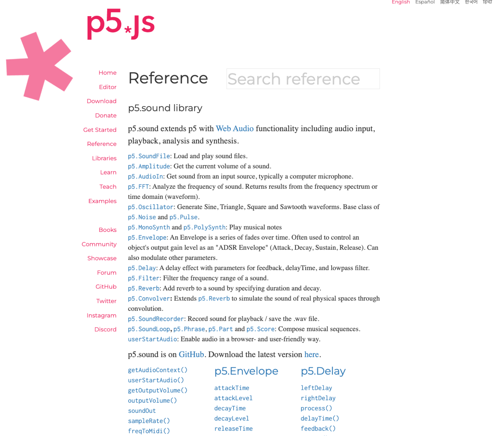

<link rel="preconnect" href="https://fonts.googleapis.com">
<link rel="preconnect" href="https://fonts.gstatic.com" crossorigin>
<link href="https://fonts.googleapis.com/css2?family=Nunito:wght@200;500;700&family=Roboto:ital,wght@0,100;0,300;0,400;0,500;0,700;1,100&display=swap" rel="stylesheet">

<link rel="stylesheet" href="./css/slidetemplate.css"> 
<!-- align:centre -->

# <!-- fit --> 

---
## Week6: 
- PCB Design Workshop by Eugene
- P5.Sound Tutorial(online)
- Technical Consultation Sessions

---

# "How to make sound performative"

---

<iframe width="560" height="315" src="https://www.youtube.com/embed/Gk6XAmALOWI" title="YouTube video player" frameborder="0" allow="accelerometer; autoplay; clipboard-write; encrypted-media; gyroscope; picture-in-picture" allowfullscreen></iframe>

---
## Interaction Design Questions
- How do you...
  - Do?
  - Feel?
  - Know?

 

<!-- ---
## Defining Design Attributes

What are the most important design elements?

- Attributes of your instrument.

---

## Write down attributes of your musical instrument as "Nouns"  (5 minutes).

Example: 
(guitar): strings, body, neck, pick, fingers, wood

---
## Write down attributes of your musical instrument as "Verbs"  (5 minutes).

e.g. (Guitar): pluck, push, slide, tremble.

---

## Write down attributes of your musical instrument as "Adjectives"  (5 minutes).

e.g. (Guitar): rhythmic, tricky, light, hollow.

---
## Make a summary of essential design attributes
 
Select 5-10 attribute elements for each noun, verb and adjective attributes those are essential for the instrument.

If there are similar duplicate or conflicting elements, 
choose the best ones. -->

---
# p5.Sound Tutorial

JavaScript library to create WebAudio
https://p5js.org/reference/#/libraries/p5.sound

---
# Week7 (after RW)
- Collective presentation then Groups consultation
- Presentation of music track (audio) + Review of technical and aesthetic development
- Production of a dirty prototype of final concept + CAD renders